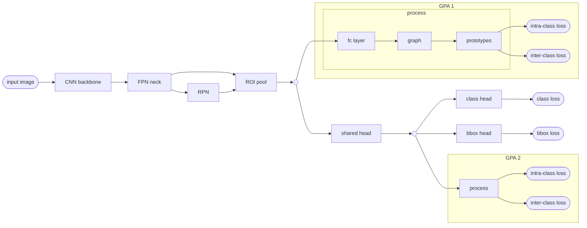
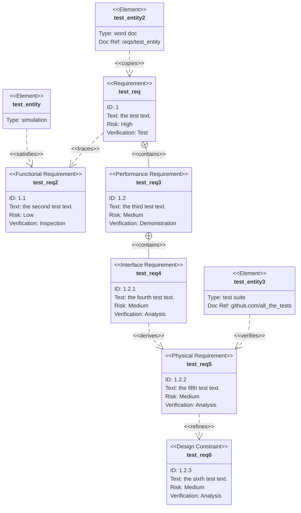

codeblock for reference
```

```

# general
- the diagrams should be simple and readable, i.e. don't use too many shades, transparency, etc. and aim for high contrast
- a background color is necessary to show the extend of the diagram
- shape borders are necessary for some shapes, which means we'll use them for all shapes but set fill-color to background color
- the primary theme color will be used for highlighting

# graphs and flowcharts
graph:


flowchart with nested subgraphs:

all shapes (flowchart, same as graph):


# sequence diagram
`-)` and `--)` arrow types will be available with newest mermaid version


# pie chart

# class diagram


# state diagram

# entity relationship diagram


# user journey diagram


# gantt chart

# requirement diagram
Will come in the next version.



# custom styling
Custom styling can still be applied with element-specific commands


or by overwriting theme-variables in the first line of the chart using

```
%%{init: {'securityLevel': 'loose', 'theme':'base'}}%%
```

___

- [[20210202143705]] Zettlr
